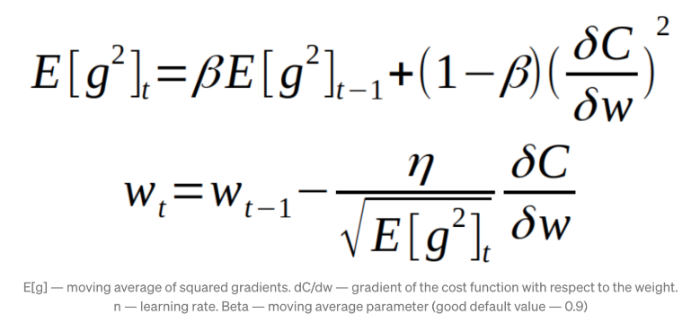
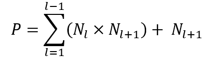

# ARN - Practical work 4   

**Group information:**

- First names1 Last names1 **Rodrigo LOPEZ DOS SANTOS**
- First names2 Last names2 **Urs BEHRMANN**

## Learning algorithm

We will use the same learning algorithm for the first 3 experiments: RMSprop. We will also use the same parameters for all the experiments.

| <!-- -->       | <!-- -->                 |
| -------------- | ------------------------ |
| Optimizer:     | RMSprop                  |
| learning_rate: | 0.001                    |
| momentum:      | 0.1                      |
| loss:          | categorical_crossentropy |
| batch_size:    | 128                      |
| n_epoch:       | 50                       |

The equation for the loss function is:

## How the number of weights is calculated

The number of weights between two layers is calculated by multiplying the number of neurons in the first layer by the number of neurons in the second layer. We also add the number of biases in the second layer.

### Example

The input layer has 784 neurons and the output layer has 10 neurons.

If we have a hidden layer with 16 neurons, the number of weights is calculated as follows:

Layer 1: $ 784 \times 16 + 16 = 12560 $
Layer 2: $ 16 \times 10 + 10 = 170 $
Total: $ 12560 + 170 = 12730 $

Inputs 392

## Do deeper networks have more weights than shallow ones?

The answer is perhaps. The number of weights in a neural network is not only determined by the number of layers, but also by the number of neurons in each layer. A deep network with few neurons in each layer can have fewer weights than a shallow network with many neurons in each layer.

The performance of a neural network is also not only determined by the number of weights. A deep network can have a better performance than a shallow network with the same number of weights. It is important to find the right balance between the number of layers and the number of neurons in each layer. Also activation functions and learning algorithms play an important role in the performance of a neural network.

# MLP from raw data

We will test three different models with different number of neurons in the hidden layers. 

For the first model, we chose a low number of neurons in the hidden layers to see how the model would perform with insufficient capacity. We hope to see the highest error rate in this model.

For the second model, we chose a number of neurons in the hidden layers that is higher than the number of neurons in the input layer. We hope to see a better performance than the first model.

For the third model, we chose a high number of neurons in the hidden layers to see how the model would perform with a high capacity. We hope to see the lowest error rate in this model, but we also expect to see overfitting.

We have the same number of inputs and outputs for all models. The input layer has 784 neurons and the output layer has 10 neurons.

## First model

model = Sequential

| Layer (type)     | Output Shape | Param # |
| ---------------- | ------------ | ------- |
| dense (Dense)    | (None, 2)    | 1,570   |
| dense_74 (Dense) | (None, 10)   | 30      |

| <!-- -->              | <!-- -->        |
| --------------------- | --------------- |
| Total params:         | 1,600 (6.25 KB) |
| Trainable params:     | 1,600 (6.25 KB) |
| Non-trainable params: | 0 (0.00 B)      |

### Performance

| <!-- -->       | <!-- -->           |
| -------------- | ------------------ |
| Test score:    | 1.1609300374984741 |
| Test accuracy: | 0.5831999778747559 |

### Confusion matrix

| <!-- -->           | <!-- -->           |
| ------------------ | ------------------ |
| F1 macro Score:    | 0.5442219669271385 |
| F1 weighted Score: | 0.5492755535704517 |
| F1 micro Score:    | 0.5832             |

## Second model

model = Sequential

| Layer (type)     | Output Shape | Param # |
| ---------------- | ------------ | ------- |
| dense_72 (Dense) | (None, 16)   | 12,560  |
| dense_74 (Dense) | (None, 10)   | 170     |

| <!-- -->              | <!-- -->          |
| --------------------- | ----------------- |
| Total params:         | 12,730 (49.73 KB) |
| Trainable params:     | 12,730 (49.73 KB) |
| Non-trainable params: | 0 (0.00 B)        |

### Performance

| <!-- -->       | <!-- -->            |
| -------------- | ------------------- |
| Test score:    | 0.17095278203487396 |
| Test accuracy: | 0.9480000138282776  |

### Confusion matrix

| <!-- -->           | <!-- -->           |
| ------------------ | ------------------ |
| F1 macro Score:    | 0.9473270917753236 |
| F1 weighted Score: | 0.9479600401672442 |
| F1 micro Score:    | 0.948              |

## Third model

model = Sequential

| Layer (type)  | Output Shape | Param # |
| ------------- | ------------ | ------- |
| dense (Dense) | (None, 254)  | 199,390 |
| dense (Dense) | (None, 10)   | 2,550   |

| <!-- -->              | <!-- -->            |
| --------------------- | ------------------- |
| Total params:         | 201,940 (788.83 KB) |
| Trainable params:     | 201,940 (788.83 KB) |
| Non-trainable params: | 0 (0.00 B)          |

### Performance
| <!-- -->       | <!-- -->            |
| -------------- | ------------------- |
| Test score:    | 0.06881905347108841 |
| Test accuracy: | 0.9811999797821045  |

### Confusion matrix

| <!-- -->           | <!-- -->           |
| ------------------ | ------------------ |
| F1 macro Score:    | 0.9809796904590385 |
| F1 weighted Score: | 0.9811910297485315 |
| F1 micro Score:    | 0.9812             |

## Conclusion of the first exercise

First model has the highest error rate, as expected, because it has the lowest capacity. There are confusions between number 2 and 6, 5 is often classified as 3, 8 as 3 and 9 as 7. This is probably because the model is not complex enough to distinguish between these numbers.

The second model has a better performance than the first model, but it is still not as good as the third model. There are no major confusions in this model.

The third model has the lowest error rate, but it is also the model with the highest capacity. We can see in the performance plots that the third model is overfitting the training data. As the second model, there are no major confusions in this model.

# MLP form HOG

We will test three different models with different number of pix_p_cells, orientations and hidden neurons.

The first one, we will keep the parameters as we got them in den notebook.

For the second one, we will increase the number of pix_p_cells to 7 and increase the hidden neurons to 16.

For the third one, we will increase the number of orientations to 16.

## First model

model = Sequential

Input layer: 392 neurons
Output layer: 10 neurons

| <!-- -->      | <!-- --> |
| ------------- | -------- |
| pix_p_cell:   | 4        |
| orientations: | 8        |

| Layer (type)     | Output Shape | Param # |
| ---------------- | ------------ | ------- |
| dense (Dense)    | (None, 2)    | 786     |
| dense_74 (Dense) | (None, 10)   | 30      |

| <!-- -->              | <!-- -->      |
| --------------------- | ------------- |
| Total params:         | 816 (3.19 KB) |
| Trainable params:     | 816 (3.19 KB) |
| Non-trainable params: | 0 (0.00 B)    |

### Performance

| <!-- -->       | <!-- -->           |
| -------------- | ------------------ |
| Test score:    | 0.6384848356246948 |
| Test accuracy: | 0.8055999875068665 |

### Confusion matrix

| <!-- -->           | <!-- -->           |
| ------------------ | ------------------ |
| F1 macro Score:    | 0.8034473897606494 |
| F1 weighted Score: | 0.8050793032002753 |
| F1 micro Score:    | 0.8056000000000001 |

## Second model

model = Sequential

Input layer: 128
Output layer: 10

| <!-- -->      | <!-- --> |
| ------------- | -------- |
| pix_p_cell:   | 7        |
| orientations: | 8        |

| Layer (type)     | Output Shape | Param # |
| ---------------- | ------------ | ------- |
| dense_72 (Dense) | (None, 16)   | 2,064   |
| dense_74 (Dense) | (None, 10)   | 170     |

| <!-- -->              | <!-- -->        |
| --------------------- | --------------- |
| Total params:         | 2,234 (8.73 KB) |
| Trainable params:     | 2,234 (8.73 KB) |
| Non-trainable params: | 0 (0.00 B)      |

### Performance

| <!-- -->       | <!-- -->            |
| -------------- | ------------------- |
| Test score:    | 0.13750861585140228 |
| Test accuracy: | 0.9553999900817871  |

### Confusion matrix

| <!-- -->           | <!-- -->           |
| ------------------ | ------------------ |
| F1 macro Score:    | 0.9551721269922793 |
| F1 weighted Score: | 0.9554019788594343 |
| F1 micro Score:    | 0.9554             |

## Third model

model = Sequential

Input layer: 256
Output layer: 10

| <!-- -->      | <!-- --> |
| ------------- | -------- |
| pix_p_cell:   | 7        |
| orientations: | 16       |

| Layer (type)  | Output Shape | Param # |
| ------------- | ------------ | ------- |
| dense (Dense) | (None, 16)   | 4,112   |
| dense (Dense) | (None, 10)   | 170     |

| <!-- -->              | <!-- -->         |
| --------------------- | ---------------- |
| Total params:         | 4,282 (16.73 KB) |
| Trainable params:     | 4,282 (16.73 KB) |
| Non-trainable params: | 0 (0.00 B)       |

### Performance
| <!-- -->       | <!-- -->           |
| -------------- | ------------------ |
| Test score:    | 0.1171414703130722 |
| Test accuracy: | 0.961899995803833  |

### Confusion matrix

| <!-- -->           | <!-- -->           |
| ------------------ | ------------------ |
| F1 macro Score:    | 0.9616971327055737 |
| F1 weighted Score: | 0.9619184118610641 |
| F1 micro Score:    | 0.9619             |

## Conclusion of the second exercise

We don't have any confusion between the numbers in this exercise, even the first model which has the lowest performance. This is probably because the model is complex enough to distinguish between these numbers and we don't have too difficult numbers to distinguish.

The first model has the lowest performance, as expected, because it has the lowest capacity. But it has still a good performance: ~80% accuracy. This is better than the first model of the first exercise which has the same capacity.

The second model has a better performance, but the training stops at ~40 epochs. This is probably because the model is overfitting the training data.

The third model has the best performance, but it is also the one which overfits the most. It begins to overfit the training data at ~20 epochs.

# CNN

In this exercise, we will test three different models with different number of neurons in the feed-forward part. We will start with a low number of neurons and increase the number of neurons in each model.

## First model 

model = functional

| Layer                | Output Shape      | Param # |
| -------------------- | ----------------- | ------- |
| l0 (InputLayer)      | (None, 28, 28, 1) | 0       |
| l1 (Conv2D)          | (None, 28, 28, 2) | 10      |
| l1_mp (MaxPooling2D) | (None, 14, 14, 2) | 0       |
| l2 (Conv2D)          | (None, 14, 14, 2) | 18      |
| l2_mp (MaxPooling2D) | (None, 7, 7, 2)   | 0       |
| l3 (Conv2D)          | (None, 7, 7, 2)   | 18      |
| l3_mp (MaxPooling2D) | (None, 3, 3, 2)   | 0       |
| flat (Flatten)       | (None, 18)        | 0       |
| l4 (Dense)           | (None, 2)         | 38      |
| l5 (Dense)           | (None, 10)        | 30      |

| <!-- -->              | <!-- -->       |
| --------------------- | -------------- |
| Total params:         | 114 (456.00 B) |
| Trainable params:     | 114 (456.00 B) |
| Non-trainable params: | 0 (0.00 B)     |

### Performance

| <!-- -->       | <!-- -->           |
| -------------- | ------------------ |
| Test score:    | 1.4822582006454468 |
| Test accuracy: | 0.3634999990463257 |

### Confusion matrix

| <!-- -->           | <!-- -->            |
| ------------------ | ------------------- |
| F1 macro Score:    | 0.2766729045340783  |
| F1 weighted Score: | 0.28665495444409084 |
| F1 micro Score:    | 0.36349999999999993 |

## Second model

model = functional

| Layer                | Output Shape      | Param # |
| -------------------- | ----------------- | ------- |
| l0 (InputLayer)      | (None, 28, 28, 1) | 0       |
| l1 (Conv2D)          | (None, 28, 28, 4) | 20      |
| l1_mp (MaxPooling2D) | (None, 14, 14, 4) | 0       |
| l2 (Conv2D)          | (None, 14, 14, 8) | 136     |
| l2_mp (MaxPooling2D) | (None, 7, 7, 8)   | 0       |
| l3 (Conv2D)          | (None, 7, 7, 8)   | 264     |
| l3_mp (MaxPooling2D) | (None, 3, 3, 8)   | 0       |
| flat (Flatten)       | (None, 72)        | 0       |
| l4 (Dense)           | (None, 4)         | 292     |
| l5 (Dense)           | (None, 10)        | 50      |

| <!-- -->              | <!-- -->      |
| --------------------- | ------------- |
| Total params:         | 762 (2.98 KB) |
| Trainable params:     | 762 (2.98 KB) |
| Non-trainable params: | 0 (0.00 B)    |

### Performance

| <!-- -->       | <!-- -->            |
| -------------- | ------------------- |
| Test score:    | 0.24304336309432983 |
| Test accuracy: | 0.9283000230789185  |

### Confusion matrix

| <!-- -->           | <!-- -->           |
| ------------------ | ------------------ |
| F1 macro Score:    | 0.9279060132915193 |
| F1 weighted Score: | 0.9283349237758494 |
| F1 micro Score:    | 0.9283             |

## Third model

model = functional

| Layer                | Output Shape       | Param # |
| -------------------- | ------------------ | ------- |
| l0 (InputLayer)      | (None, 28, 28, 1)  | 0       |
| l1 (Conv2D)          | (None, 28, 28, 8)  | 40      |
| l1_mp (MaxPooling2D) | (None, 14, 14, 8)  | 0       |
| l2 (Conv2D)          | (None, 14, 14, 16) | 528     |
| l2_mp (MaxPooling2D) | (None, 7, 7, 16)   | 0       |
| l3 (Conv2D)          | (None, 7, 7, 16)   | 1040    |
| l3_mp (MaxPooling2D) | (None, 3, 3, 16)   | 0       |
| flat (Flatten)       | (None, 144)        | 0       |
| l4 (Dense)           | (None, 8)          | 1160    |
| l5 (Dense)           | (None, 10)         | 90      |

| <!-- -->              | <!-- -->         |
| --------------------- | ---------------- |
| Total params:         | 2,858 (11.16 KB) |
| Trainable params:     | 2,858 (11.16 KB) |
| Non-trainable params: | 0 (0.00 B)       |

### Performance

| <!-- -->       | <!-- -->            |
| -------------- | ------------------- |
| Test score:    | 0.07541753351688385 |
| Test accuracy: | 0.9768000245094299  |

### Confusion matrix

| <!-- -->           | <!-- -->           |
| ------------------ | ------------------ |
| F1 macro Score:    | 0.9765884358846029 |
| F1 weighted Score: | 0.97675954914543   |
| F1 micro Score:    | 0.9768             |

## Conclusion of the third exercise

The first model has the lowest performance, as expected, because it has the lowest capacity. It has the worst performance from all first models with a ~36% accuracy. There are confusions between number 2 and 6, 5 is often classified as 3, 8 as 3 and 9 as 7. This is probably because the model is not complex enough to distinguish between these numbers. It could only classify 1 really good and 4 and 7 around 70% of the time. All other numbers are classified around correctly 40% or less .

The second model has a better performance, but the training isn't quite finished with 50 epochs. This shows in the confusion matrix, where it only gets to ~93% accuracy. There are no major confusions in this model. This model has only a few minor confusions,  like 7 with 2, 5 with 8, 0 with 1. Probably because the images were more difficult to distinguish.

The third model has the best performance, but it is also the one which overfits the most. It begins to overfit the training data at ~20 epochs. It still does have the best performance of this experiment with a ~97% accuracy. A the second model, there are no major confusions in this model. We have negligible confusions between 9 with 4, 8 with 5, 2 with 7. Same as the second model, probably because the images were more difficult to distinguish, but it could classify images which the second model couldn't.

# CNN for chest x-ray pneumonia recognition

## Weights

| Layer            | Output Shape        | Param # |
| ---------------- | ------------------- | ------: |
| input_layer      | (None, 128, 128, 1) |       0 |
| conv_1 (Conv2D)  | (None, 128, 128, 8) |      16 |
| max_pooling_1    | (None, 64, 64, 8)   |       0 |
| conv_2 (Conv2D)  | (None, 64, 64, 16)  |     144 |
| max_pooling_2    | (None, 32, 32, 16)  |       0 |
| conv_3 (Conv2D)  | (None, 32, 32, 32)  |     544 |
| max_pooling_3    | (None, 16, 16, 32)  |       0 |
| conv_4 (Conv2D)  | (None, 16, 16, 64)  |   2,112 |
| max_pooling_4    | (None, 8, 8, 64)    |       0 |
| conv_5 (Conv2D)  | (None, 8, 8, 128)   |   8,320 |
| max_pooling_5    | (None, 4, 4, 128)   |       0 |
| flatten_7        | (None, 2048)        |       0 |
| dense_21 (Dense) | (None, 32)          |  65,568 |
| dense_22 (Dense) | (None, 16)          |     528 |
| dense_23 (Dense) | (None, 1)           |      17 |

| <!-- -->              | <!-- -->           |
| --------------------- | ------------------ |
| Total params:         | 77,249 (301.75 KB) |

## Performance

## Validation

| <!-- -->       | <!-- -->            |
| -------------- | ------------------- |
| F1 score:      | 0.8889               |

## Conclusion of the fourth exercise

The model has a good performance with a ~89% accuracy. It only classified one of the 16 images wrong. The model could be improved by increasing the number of epochs. At the 3rd epoch, we have a dip in validation accuracy, which could be improved by training the model for more epochs.

I tried to see the differences between the images with pneumonia and the images without pneumonia. I couldn't see any differences between the images. While I could classify the numbers correctly in the previous exercises. This CNN model could probably have a 100% accuracy if we had trained it at the number classification task.

